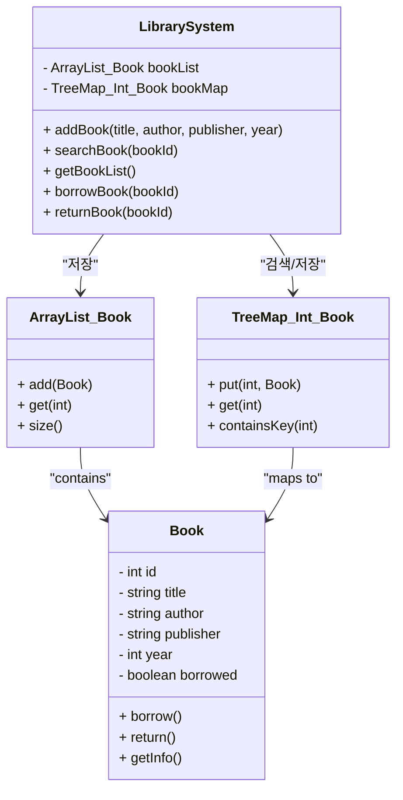
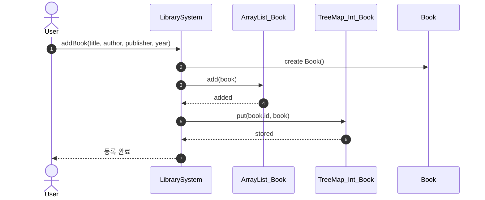
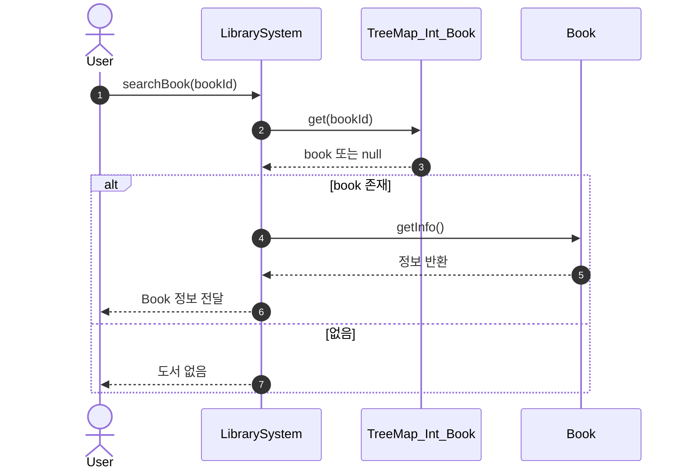
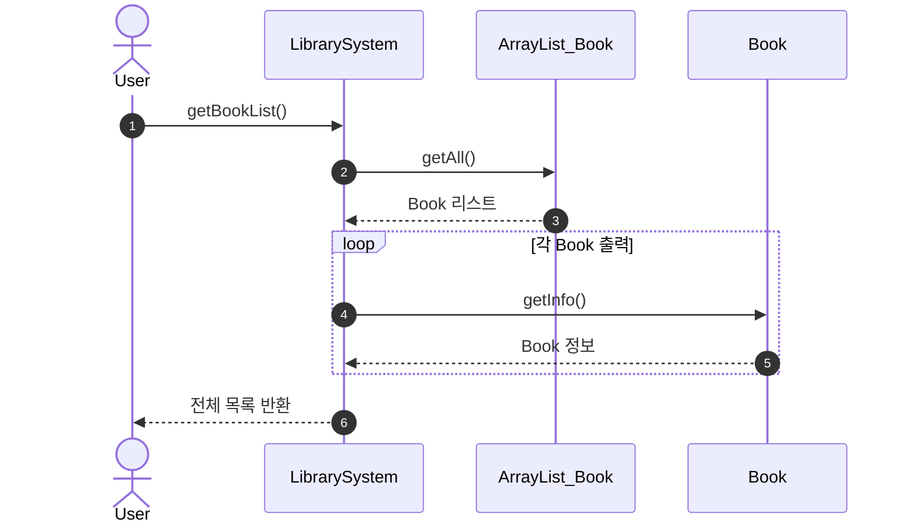
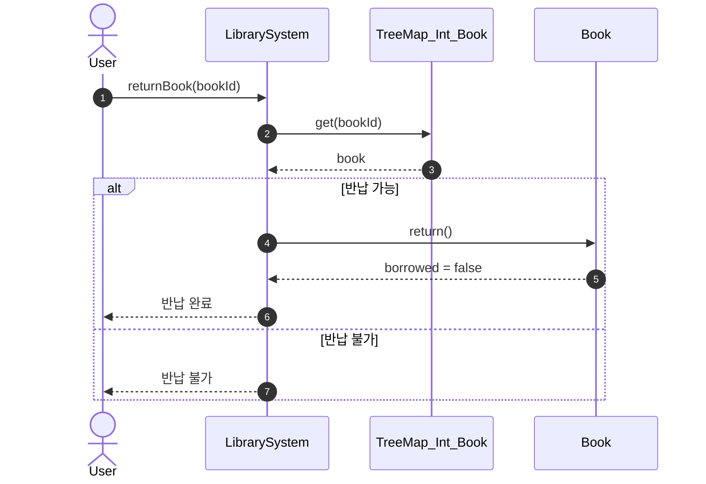

# 1. 개요

## 목적

청주대학교 도서관 시스템에 기반한 도서 저장, 검색, 출력, 대출, 반납 기능 시스템 v1.0을 개발

## 범위

- 도서 정보 저장 → 검색 → 결과 출력
    - [A] 도서 정보 저장
        
         도서명, 저자, 출판사, 출판 연도 속성 값 저장
        
    - [B] 검색
        
        저장 되어 있는 속성 값으로 검색 후 대출, 반납 여부 출력
        
    - 대출
        
        저장 값이 입력되면 대출되었습니다 라는 안내문구 출력
        
    - 반납
        
        대출되어 있는 값이 입력되면 반납 되었다는 문구를 출력
        
    - [C] 결과
        
        4개의 기능 중 하나를 선택하고 맞는 값을 입력하여 결과 화면 출력 
        
    - [D]  저장된 파일을 CSV로 저장
        
        데이터 관리를 위해  JCF(Java Collection Framework)  사용
        

## 역할

| **역할** | **개발 기능** | **담당자** | **역할** |
| --- | --- | --- | --- |
| PM | 기능 1개 | 김근형 | 노션 작성 |
| Coding&Testing | 기능 1개 | 박정균 | 발표 |
| Coding&Testing | 기능 2개 | 박찬웅 | 개발 |

## 사용 기술

- 클래스와 객체
- Github
    - 이슈 : 이슈 관리
    - Branch 생성 : 코드 분리
    - Pull Request : 코드 머지
- JUnit : 단위 테스트
- Notion : 문서 공유
- JCF(Java Collection Framework) : 데이터 관리

## 기능 목록

- 도서를 속성 값에 따라 저장해주는 기능
- 저장 되어있는 속성들을 입력하여 검색하는 기능
- 저장되어있는 값에 따라 대출 되었다는 결과를 출력해주는 기능
- 대출 되어있는 값을 입력하여 다시 반납 되었다는 결과를 출력하는 기능
- 데이터를 파일(csv)에 저장/불러오기 기능 활용
- 데이터 관리를 위해 JCF 기능 활용

# 2. 요구사항 정의서

- 위 기능들을 대상으로 요구사항을 작성한다.

- 기능 요구 사항
    - [ ]  [1]`LibrarySystem` 의 모든 기능(저장,검색,출력,대출,반납)을 동일하게 수행 할 수 있어야 한다.
        - [ ]  협력, 역할, 책임 정의 완료
        - [ ]  클래스 설계 완료
        - [ ]  SW개발 완료
        - [ ]  단위 테스트 실행 완료
    - [ ]  [2] 입력예시(도서명, 저자, 출판사, 출판연도)에 따라 입력된 값을 저장하기 저장되어 있지 않을 경우 안내문구 출력한다.
        - [ ]  협력, 역할, 책임 정의 완료
        - [ ]  클래스 설계 완료
        - [ ]  SW 개발 완료
        - [ ]  단위 테스트 실행 완료
    - [ ]  [3] 저장되어 있는 값을 속성 값에 따라 검색하고 대출 여부 출력하기
        - [ ]  협력, 역할, 책임 정의 완료
        - [ ]  클래스 설계 완료
        - [ ]  SW 개발 완료
        - [ ]  단위 테스트 실행 완료
    - [ ]  [4] 저장되어 있는 값에 따라 대출 수행하기
        - [ ]  협력, 역할, 책임 정의 완료
        - [ ]  클래스 설계 완료
        - [ ]  SW 개발 완료
        - [ ]  단위 테스트 실행 완료
    - [ ]  [5] 저장되어 있는 값을 속성 값에 따라 검색하고 반납 여부 출력하기
        - [ ]  협력, 역할, 책임 정의 완료
        - [ ]  클래스 설계 완료
        - [ ]  SW 개발 완료
        - [ ]  단위 테스트 실행 완료
    - [ ]  [6] 저장되어 있는 값에 따라 반납 수행하기
        - [ ]  협력, 역할, 책임 정의 완료
        - [ ]  클래스 설계 완료
        - [ ]  SW 개발 완료
        - [ ]  단위 테스트 실행 완료

# 3. 설계

## 3.1 협력, 역할, 책임 정의

### 3.1.1 협력 정의

- 사용자가 속성에 맞게 검색을 입력하면 저장된 리스트에 일치하는 도서 정보를 출력한다.
- 저장되어 있지 않을 정보를 입력 시 ‘도서 저장을 해주세요’ 라는 안내 문구를 출력한다.
- 사용자가 도서의 정보(도서명, 저자, 출판사, 출판 연도)를 CSV에 저장한다.
- 사용자가 도서의 정보(도서명, 저자,출판사,출판연도)를 검색하여 해당 도서를 불러온다.

### 3.1.2 역할 정의

- 입력된 도서 정보로 저장, 검색, 출력, 대출, 반납 수행
- 저장되어있는 도서의 정보(도서명, 저자, 출판사, 출판 연도)를 CSV에 저장하고 불러온다.
- 저장되어 있는

### **3.1.3 책임 정의**

## 3.2 데이터 정의

### 3.2.1 데이터 포멧 정의

| 구분 | 도서명 | 저자 | 출판사 | 출판 연도 |
| --- | --- | --- | --- | --- |
| 데이터1 | 자바의 정석 | 남궁성 | 출판사 | 2025 |
| 변수 타입 | String | String | String | Int |
| 위치 | Array[0] | Array[1] | Array[2] | Array[3] |

### 3.2.2 클래스에서 데이터 정의

```java
public class Book
{
//고유 번호인 isbn 기능 추가 하고 키 값으로 지정
		private String title;       // 도서명
    private String author;      // 저자
    private String publisher;   // 출판사
    private int year;           // 출판연도
}
```

### 3.2.3 파일처리 방법 정의

```
isbn,title,author,publisher,year
978-11-1111-1111,자바의 정석,남궁성,도우출판,2000
978-11-1111-1112,이것이 자바다,신용권,한빛미디어,2021

```

## 3.2 클래스 설계(GPT, Mermaid 활용)

### 3.2.1 (구조 정의) 클래스 다이어그램



### 3.2.3 (절차 정의) 스퀀스 다이어그램









## 3.3 화면 정의(GPT 활용)

### 3.3.1 메인 화면

```jsx
=== 도서 관리 시스템 ===

1. 도서 저장
2. 도서 검색
3. 전체 도서 출력
4. 도서 대출
5. 도서 반납
6. 도서 목록 보기
7. 종료
메뉴 선택:
```

### 3.3.2 서브 화면

### 저장

메인 화면에서 1을 입력받을 경우

```jsx
메뉴 선택: 1
도서명: 홍길동전
저자: 홍길동
출판사: 홍길동출판사
출판 연도: 1899
도서 저장 완료! (ID: 1)

```

### 검색

메인 화면에서 2을 입력받을 경우

```jsx
메뉴 선택: 2
도서명: 홍길동
저자: 홍길동
출판사: 홍길동출판사
출판 연도: 1999
[2] 홍길동 - 홍길동 / 홍길동출판사 (1999)  ▶ 대출 가능

```

### 출력

메인 화면에서 3을 입력받을 경우

```jsx
메뉴 선택: 3
[1] 책 - 0 / 12312 (12)  ▶ 대출 가능
[2] 홍길동 - 홍길동 / 홍길동출판사 (1999)  ▶ 대출 가능

```

### 대출

메인 화면에서 4을 입력받을 경우

```jsx
메뉴 선택: 4
대출할 도서 ID: 2
대출 완료!

```

### 반납

메인 화면에서 5을 입력받을 경우

```jsx
메뉴 선택: 5
반납할 도서 ID: 2
반납 완료!

```

### 종료

메인 화면에서 0을 입력받을 경우

```jsx
메뉴 선택: 0
프로그램 종료
```

## 3.4 단위테스트 케이스/결과서

- [ ]  [1] 도서 정보 입력 테스트
    1. 대상 함수 : `bool save(String Name, Sting title, String author, String publisher, int year)`
        - 정상
            - 함수 입력 : "책1", "저자1", ”출판사1”,  2000
            - 결과 : True
        - 오류1 : 출판사 누락
            - 함수 입력 : "책1", "저자1", null,  2000
            - 결과 : False
        - 오류2: 제목 틀림
            - 함수 입력 : "없는책", "저자1", ”출판사1”,  2000
            - 결과 : False

## 3.5 요구사항 정의서 점검

# 4. 개발 및 테스트

## 4.1 요구사항 추적(기능 개발 이후 표시)

- [ ]  도서의 기본 속성(isbn,title,author,publisher,year)을 저장한다.
- [ ]  도서의 대출 여부를 확인하고 결과를 출력한다.
- [ ]  대출된 도서를 다시 반납하는 기능을 통해 상태를 변경하고 출력한다.
- [ ]  JCF 기능(ArrayList, TreeMap)을 활용하여 도서를 관리한다.

## 4.2 Github URL

오류 발생한 repositiory URL:  https://github.com/yahahahoho/Java-Library-System/issues

오류 발생으로 인해 새로 만든 repository URL:   https://github.com/kkh-03/library-System.git

# 5. 피드백

## 1. **달성하고자 하는 목표는?**

<aside>
✏️

작성요령

- 가능하다면 측정 가능한 목표를 작성한다.
- 프로젝트의 목표와 개인의 목표는 무엇이었나요?
- 우리가 설정했던 계획은 무엇이었나요? (일정, 역할, 기술 스택 등)
</aside>

- 도서관 프로그램 v1.5 개발
    - JCF와 CSV를 활용하여 데이터를 저장 및 관리 기능 활용

## 2. **달성한 목표는?**

<aside>
✏️

작성요령

- 측정한 목표에서 달성한 결과를 작성한다.
</aside>

- 2개 기능 중 2개 완료

## 3. 그 차이와 원인은?

<aside>
✏️

작성요령

- 목표를 달성했다면(는 달성하지 못했다면) 행동들을 분석해야 한다.
    - 분석을 통해 목표를 달성할 수 있었던(또는 달성에 실패한) 행동 패턴과 원리를 학습하는 것이 중요하다.
- 왜 그런 일이 일어났는가? 🤔
    - 어떤 행동 패턴이 목표를 달성하게 만들었는가?
    - 목표를 달성하지 못한 근본적인 행동 원인은 무엇인가?
    - 어느 점에서 차이가 발생했는가?
    - 실패 또는 어려움의 주요 원인은 무엇이었나요? 기술적인 문제였나요, 아니면 소통이나 협업의 문제였나요?
    - 개인적으로 어떤 부분이 부족했거나 개선이 필요하다고 느끼나요?
- 단, 달성하지 못한 원인은 외부에서 찾는 것은 의미가 없다.
</aside>

- 요구사항을 중간 중간 점검하면서 개발했다.
- 체계적으로 개발을 진행했다.
    - 암묵지 → 형식지
- 소통의 부족으로 인해 개발 중에 실수가 있어 개발에 어려움이 조금 있었다.

## 4. 앞으로 해야 할 일은?

<aside>
✏️

작성요령

- 이번 경험을 통해 배운 가장 중요한 교훈은 무엇인가요?
- 다음 프로젝트에서는 어떤 부분을 유지하고 어떤 부분을 개선해야 할까요?
</aside>

- 교훈
    - 개발을 하면서 간간히 브랜치 만드는것을 잊어버릴 때가 있었는데 나중의 상황을 위해서라도 잊지 않고 브랜치 만들어 코드를 제작하는것을 상기해야겠다고 느꼈다.
    - 구체적인 계획(프로젝트의 방향성, 유지보수, 디렉토리 구조, 브랜치 전략 등)을 다 세운 뒤에 개발 진행
- 유지
    - 계획하고 진행
    - 단위 테스트 진행
    - 
- 개선
    - 더 구체적으로 소통하면서 개발 계획을 세우는 것이  좋을 것 같다.

## 5. 앞으로 하지 말아야 할 일은?

<aside>
✏️

작성요령

- 이번 경험을 통해 배운 가장 중요한 교훈은 무엇인가요?
- 목표 달성에 방해가 되는 행동을 생각하고, 그 부분을 작성한다.
</aside>

- 너무 개인적으로 하려 하지 말고 중요한 부분들은 서로 이야기하며 여러 번 확인하여 실수가 나오지 않도록 해야 될 것 같다.
- 가끔 서브 브랜치를 만들지 않고 개발을 진행하는 습관을 고쳐나가야 할 것 같다.
